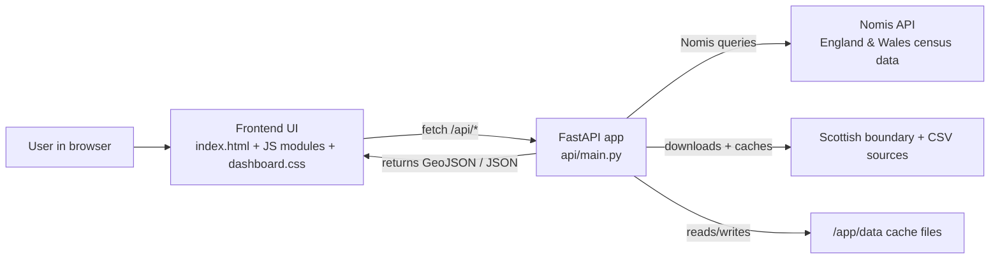
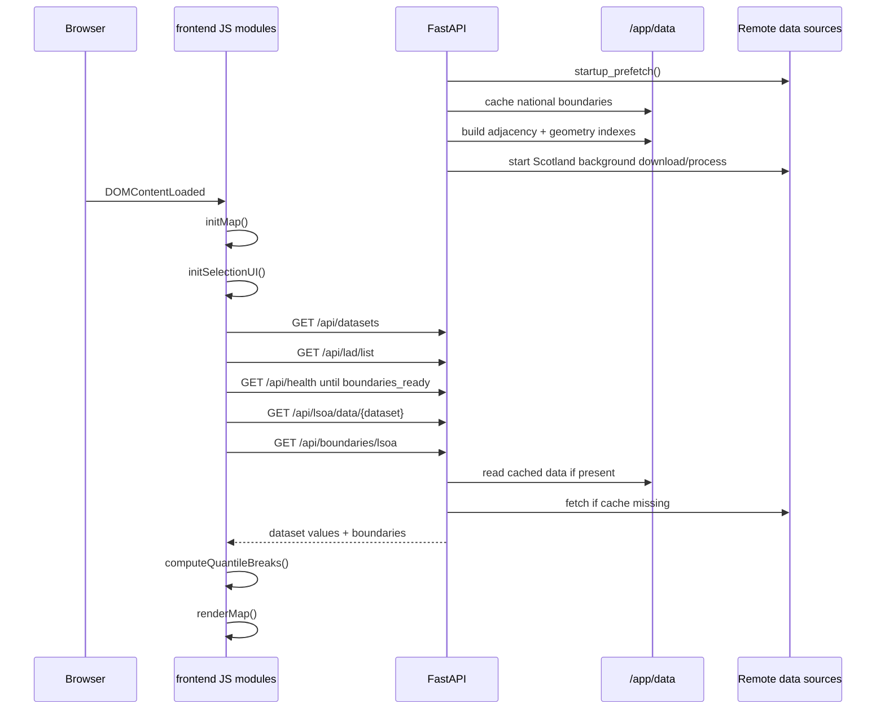
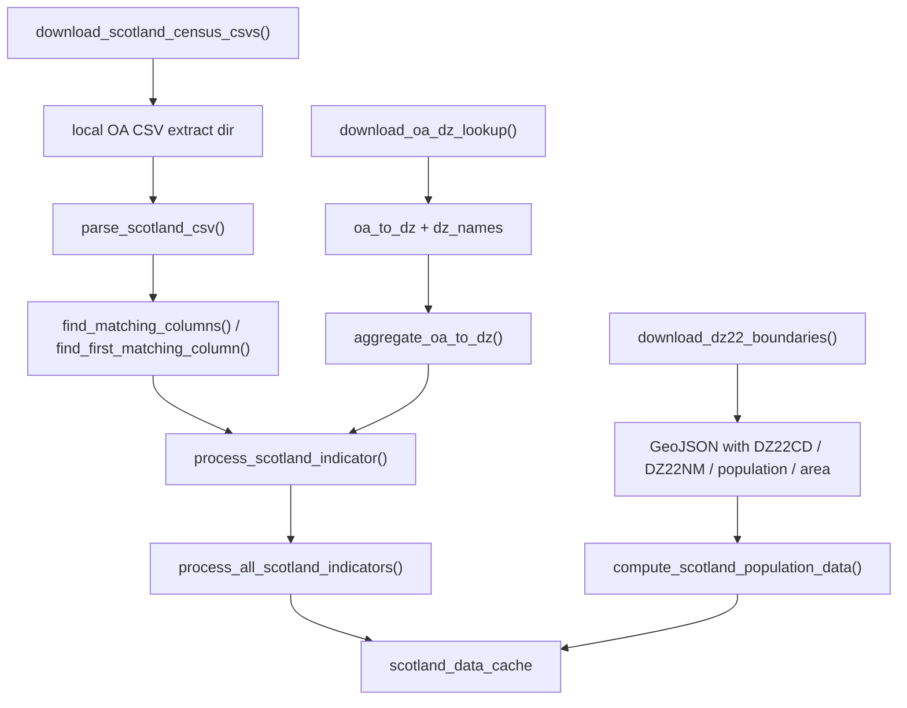
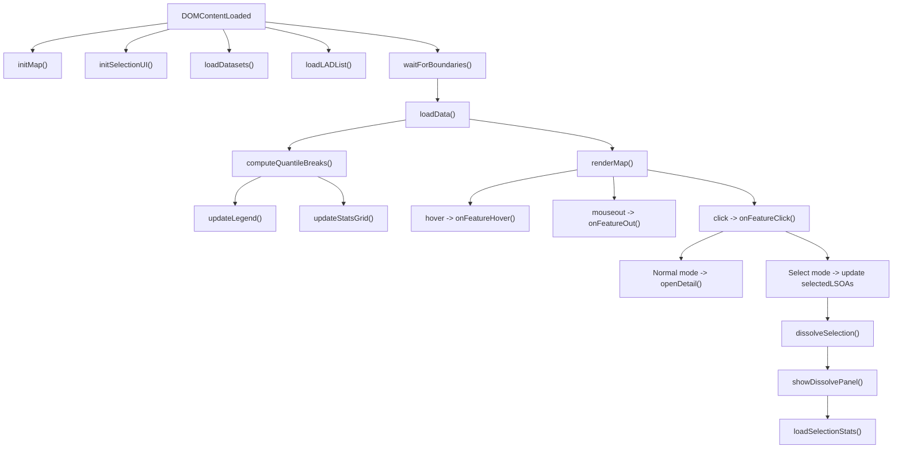

# Census Dashboard Codebase Explainer

This document is a visual walkthrough of how the app runs, which functions matter most, and which variables carry state across the system.

## 1. System Shape

## 2. Runtime Flow

## 3. Backend Structure

### Main globals in `api/main.py`

| Variable | Type | Purpose |
|---|---|---|
| `data_cache` | `TTLCache` | In-memory response cache for datasets, boundaries, detail, LAD list |
| `DATA_DIR` | `Path` | Persistent cache directory under `/app/data` |
| `adjacency_graph` | `dict[str, list[str]]` | Area code to neighbouring area codes |
| `lsoa_geometries` | `dict[str, Geometry]` | Shapely geometry index used for dissolve |
| `scotland_oa_to_dz` | `dict[str, str]` | Output Area to Data Zone lookup |
| `scotland_dz_names` | `dict[str, str]` | Data Zone code to name lookup |
| `scotland_data_cache` | `dict[str, dict]` | Scotland-only processed dataset cache |
| `CENSUS_DATASETS` | `dict` | Core dataset catalogue, metadata, and fetch rules |
| `DETAIL_DATASETS` | `list[dict]` | Category breakdown datasets for the detail panel |

### Important backend entry points

| Function | What it does | Key inputs | Key outputs |
|---|---|---|---|
| `startup_prefetch()` | Warms boundary caches and indexes | none | cached files + in-memory indexes |
| `_build_adjacency_graph()` | Builds neighbour graph from E&W geometries | `bsc_file` | `adjacency_graph` |
| `_build_geometry_index()` | Loads geometries for dissolve operations | `bsc_file` | `lsoa_geometries` |
| `get_lsoa_data()` | Returns map values for a dataset | `dataset_id`, `lad_code` | `{values, names, stats}` |
| `get_lsoa_boundaries()` | Returns national or LAD GeoJSON | `lad_code`, `resolution` | GeoJSON FeatureCollection |
| `get_lsoa_detail_ep()` | Returns detail-panel data for a selected area | `lsoa_code` | grouped category values |
| `dissolve_selection()` | Unions selected geometries into one boundary | `SelectionRequest` | GeoJSON Feature |
| `aggregate_selection()` | Computes selection summary values | `AggregateRequest` | dataset aggregate JSON |
| `fetch_nomis_data()` | Fetches E&W dataset data from Nomis | dataset config | normalized values/names/stats |

## 4. Scotland Processing Path

### Key functions in `api/scotland.py`

| Function | Role | Core variables |
|---|---|---|
| `_simplify_ring(coords, target)` | Thins polygon vertices | `coords`, `target`, `step` |
| `_simplify_geometry(geom)` | Simplifies polygon or multipolygon | `geom`, `parts` |
| `parse_scotland_csv(csv_path)` | Reconstructs multi-row headers and OA rows | `lines`, `header_rows`, `column_labels`, `oa_data` |
| `aggregate_oa_to_dz(oa_data, oa_to_dz, numerator_cols, denominator_col)` | Sums OA data into DZ totals/rates | `dz_num`, `dz_den`, `result` |
| `process_scotland_indicator(...)` | Applies table-specific matching rules and emits normalized data | `mapping_info`, `num_cols`, `den_col`, `values`, `stats` |
| `compute_scotland_population_data(...)` | Uses boundary attributes for total population and density | `density_values`, `total_values`, `names` |

## 5. Frontend Structure

### Main state object in `frontend/static/js/modules/core.js`

| Field | Meaning |
|---|---|
| `map` | Leaflet map instance |
| `geojsonLayer` | Current map layer containing all boundaries |
| `currentDataset` | Active dataset id |
| `currentLAD` | Current LAD or Scottish council filter |
| `datasets` | Dataset metadata from `/api/datasets` |
| `currentValues` | Area code to metric value for current dataset |
| `currentStats` | Summary stats for legend and stats grid |
| `currentColorScheme` | Name of palette to use |
| `quantileBreaks` | 7 thresholds used by choropleth coloring |
| `selectedLSOA` | Last clicked area in normal mode |
| `geojsonData` | Raw boundary GeoJSON for current view |
| `selectMode` | Whether click means select/deselect instead of open detail |
| `selectedLSOAs` | Set of currently selected areas |
| `dissolvedLayer` | Leaflet layer for merged selection outline |
| `dissolveResult` | Last dissolve API result |
| `adjacency` | Client copy of neighbour graph |

### Frontend function groups

| Group | Functions | Purpose |
|---|---|---|
| Boot | `initMap`, `initSelectionUI`, `waitForBoundaries`, `loadDatasets`, `loadLADList`, `loadData` | Bring the app to a renderable state |
| Rendering | `renderDatasetList`, `renderMap`, `styleFeature`, `getColour`, `computeQuantileBreaks`, `updateLegend`, `updateStatsGrid` | Paint UI and choropleth |
| Map interaction | `onFeatureHover`, `onFeatureOut`, `onFeatureClick`, `openDetail`, `renderDetailPanel`, `closeDetail` | Handle user exploration |
| Selection mode | `toggleSelectMode`, `updateSelectionUI`, `clearSelection`, `dissolveSelection`, `showDissolvePanel`, `loadSelectionStats`, `renderSelectionStats`, `exportSelection` | Multi-area workflows |
| Utility | `setOverlay`, `setStatus`, `fitToBounds`, `findDataset`, `fmt`, `fmtInt` | Shared helpers |

## 6. Frontend Execution Map

## 7. What Happens During Common User Actions

### A. User changes dataset

1. `onDatasetChange()` updates `state.currentDataset`.
2. The browser requests `/api/lsoa/data/{datasetId}`.
3. The API loads from `data_cache`, disk cache, or remote source.
4. The frontend replaces `currentValues` and `currentStats`.
5. `computeQuantileBreaks()`, `updateLegend()`, and `styleFeature()` repaint the map.

### B. User changes LAD/council area

1. `onLADChange()` sets `state.currentLAD`.
2. Existing detail and selection state are cleared.
3. `loadData()` requests both values and boundaries for the new filter.
4. `renderMap()` replaces the current GeoJSON layer.

### C. User selects multiple areas

1. `toggleSelectMode()` switches map clicks into selection mode.
2. `onFeatureClick()` adds/removes area codes in `selectedLSOAs`.
3. `dissolveSelection()` sends those codes to `/api/selection/dissolve`.
4. The API unions Shapely geometries and returns a merged boundary plus metadata.
5. `showDissolvePanel()` renders area, perimeter, centroid, and connectivity.

## 8. Architectural Observations

- The backend does most of the heavy lifting and normalization.
- `api/main.py` is the orchestration hub, but it is doing many jobs at once: startup, caching, API routes, geometry processing, Nomis fetching, and aggregation.
- The frontend keeps a single shared `state` object, which makes flow easy to follow but also makes side effects easy to couple.
- Scotland support is implemented as an adaptation layer rather than a fully parallel data model.

## 9. Good Mental Model

Think of the app as three layers:

1. `dataset catalogue`
   This defines what can be shown and how to fetch/calculate it.
2. `normalized area data`
   The API turns E&W Nomis data and Scotland CSV data into a shared `{values, names, stats}` shape.
3. `map rendering and selection UX`
   The frontend takes that normalized shape and applies color, hover, detail, and dissolve interactions.

## 10. Suggested Refactor Boundaries

This refactor now uses these split points:

- Nomis fetchers and dataset logic live in `api/services/datasets.py`.
- Dataset catalogue configuration lives in `api/services/dataset_config.py`.
- Dissolve, adjacency, and boundary geometry logic live in `api/services/geometry.py`.
- Scotland ingestion and mapping remain centralized in `api/scotland.py`.
- The frontend is split into ordered browser modules under `frontend/static/js/modules/`.
